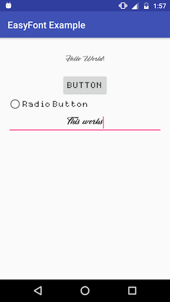

# EasyFont for Android

Standalone Android widget which let's you set font easily from layout.



## Usage

Create ```assets``` folder in ```src/main```, and add your fonts there (inside ```src/main/assets/``` folder). Include ```TextView```, ```Button```, ```EditText```, or ```RadioButton``` in your layout file.

```xml
<com.koonat.easyfont.TextView
    android:layout_width="wrap_content"
    android:layout_height="wrap_content"
    android:text="TextView"
    app:font_path="your-folder-where-you-put-fonts/font_name.ttf"
    />
```

```xml
<com.koonat.easyfont.Button
    android:layout_width="wrap_content"
    android:layout_height="wrap_content"
    android:text="Button"
    app:font_path="your-folder-where-you-put-fonts/font_name.ttf" 
    />
```

```xml
<com.koonat.easyfont.RadioButton
    android:layout_width="wrap_content"
    android:layout_height="wrap_content"
    android:text="RadioButton"
    app:font_path="your-folder-where-you-put-fonts/font_name.ttf"
    />
```

```xml
<com.koonat.easyfont.EditText
    android:layout_width="wrap_content"
    android:layout_height="wrap_content"
    android:hint="EditText"
    app:font_path="your-folder-where-you-put-fonts/font_name.ttf"
    />
```


## Download

The latest version can be downloaded in [zip](https://github.com/natiginfo/EasyFont/archive/master.zip) and referenced by your application as a library project.

You can also depend on the library through Maven or Gradle:

### Step 1 (Maven):
Add the JitPack repository to your build file
```xml
<repositories>
	<repository>
	    <id>jitpack.io</id>
	    <url>https://jitpack.io</url>
	</repository>
</repositories>
```

### Step 2 (Maven):
Add the dependency
```xml
<dependency>
    <groupId>com.github.natiginfo</groupId>
    <artifactId>EasyFont</artifactId>
    <version>v1.0.1</version>
</dependency>
```

### Step 1 (Gradle):
Add it in your root build.gradle at the end of repositories:

```groovy
allprojects {
	repositories {
		...
		maven { url 'https://jitpack.io' }
	}
}
```

### Step 2 (Gradle):
Add the dependency

```groovy
dependencies {
	compile 'com.github.natiginfo:EasyFont:v1.0.1'
}
```

## Developed by

[Natig Babayev](https://www.linkedin.com/in/natiginfo/) - [natig.nizami@gmail.com](mailto:natig.nizami@gmail.com)

## Donation

If this project help you reduce time to develop, you can give me a cup of coffee :) 

[](http://textber.me/support/)

## License
```
Copyright 2017 Natig Babayev.

Licensed under the Apache License, Version 2.0 (the "License");
you may not use this file except in compliance with the License.
You may obtain a copy of the License at

   http://www.apache.org/licenses/LICENSE-2.0

Unless required by applicable law or agreed to in writing, software
distributed under the License is distributed on an "AS IS" BASIS,
WITHOUT WARRANTIES OR CONDITIONS OF ANY KIND, either express or implied.
See the License for the specific language governing permissions and
limitations under the License.
```
